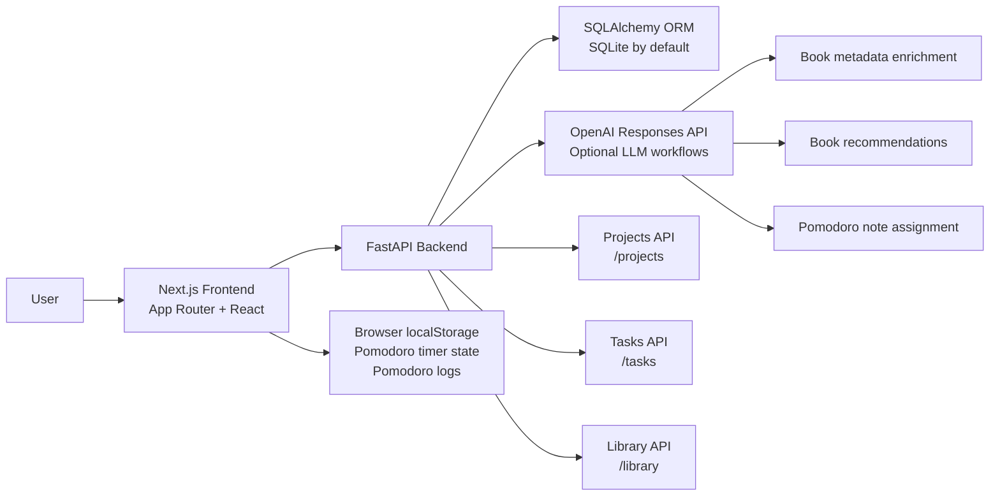
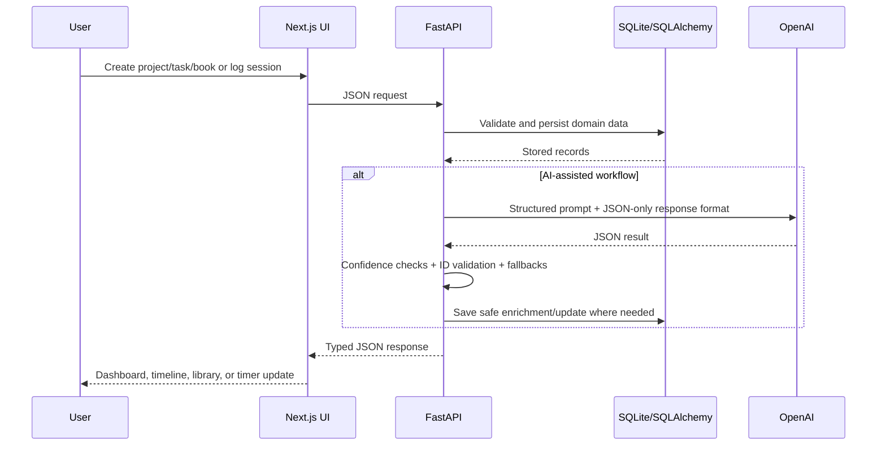
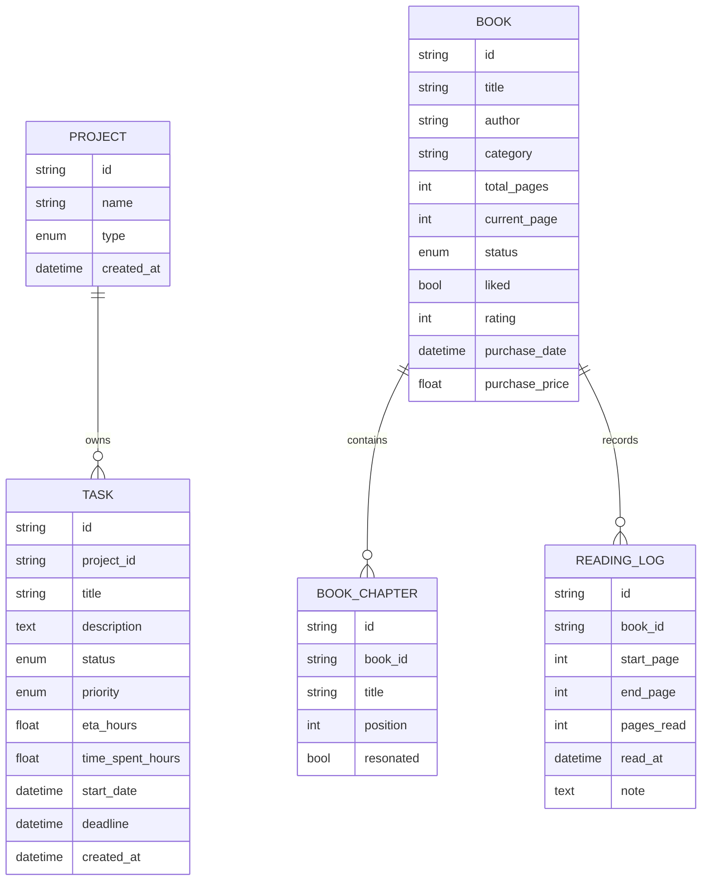

# Personal Project Manager

> A focused execution cockpit for projects, tasks, Pomodoro work logs, and a personal reading library, with optional OpenAI-powered assistance where judgement helps more than form fields.

Personal Project Manager is a full-stack productivity system built for one person who wants to see both the plan and the real execution trail. It tracks fixed projects, continuous habits, task timelines, time investment, Pomodoro sessions, reading momentum, owned books, chapter resonance, and AI-assisted recommendations.

---

## What It Does

| Area | Purpose | Highlights |
| --- | --- | --- |
| Dashboard | See execution health across all projects | Project rollups, active/overdue task counts, planned vs spent hours, fixed vs continuous project logic |
| Project Detail | Manage the actual work | Task CRUD, status/priority filters, ETA, time spent, deadlines, timeline bars |
| Timeline | Plan work visually | 3-day, weekly, and monthly views, today marker, active-today filter, draggable deadline updates |
| Pomodoro | Convert focus sessions into task time | Persistent timer, manual session logs, focus/energy notes, heatmap, session history |
| Library | Track books and reading momentum | Purchases, pages read, monthly reading chart, chapters, resonance tracking, next-book suggestions |
| Shelf | Inspect the full collection | Editable book table, total spend/pages/read stats, expanded book details |

---

## System Design



### Runtime Flow



---

## Architecture

### Frontend

The frontend lives in `frontend/` and uses the Next.js App Router.

```text
frontend/
  app/
    page.tsx                  Dashboard
    project/[id]/page.tsx     Project task workspace
    timeline/page.tsx         Cross-project planning timeline
    pomodoro/page.tsx         Timer, session logging, heatmap
    pomodoro/history/page.tsx Session history from localStorage
    library/page.tsx          Reading dashboard
    library/shelf/page.tsx    Full book shelf
  components/                 Reusable project/task/timer UI
  lib/api.ts                  Typed API client
  lib/pomodoroSession.ts      Browser persistence helpers
```

Important frontend behavior:

- `frontend/lib/api.ts` centralizes all backend calls and TypeScript API types.
- Pomodoro timer state and completed session logs are persisted in `localStorage`, so a timer can survive navigation and reloads.
- Completed Pomodoro focus time can be invested into tasks by updating `time_spent_hours` through the backend.
- The UI is intentionally task-dense: cards, tables, filters, timeline rows, charts, and quick edit flows are optimized for repeated personal use.

### Backend

The backend lives in `backend/` and uses FastAPI, SQLAlchemy, Pydantic, and the OpenAI Python SDK.

```text
backend/app/
  main.py              FastAPI app, CORS, router setup, SQLite compatibility patches
  database.py          DATABASE_URL config, SQLAlchemy engine/session
  models.py            Project, Task, Book, BookChapter, ReadingLog models
  schemas.py           Pydantic request/response contracts
  crud.py              Business logic, summaries, LLM calls, fallbacks
  prompts.py           System/user prompts for assistant workflows
  routes/
    project.py         Project and project summary endpoints
    task.py            Task endpoints and Pomodoro assignment endpoint
    library.py         Book, chapter, reading log, recommendation endpoints
```

Backend design choices:

- SQLite is the default database for local-first use.
- `DATABASE_URL` keeps the database layer portable to Postgres or other SQLAlchemy-supported databases.
- `main.py` creates tables automatically and includes compatibility patches for older SQLite schemas.
- Pydantic schemas define the API surface separately from SQLAlchemy models.
- OpenAI calls are optional: without `OPENAI_API_KEY`, the app still works and uses deterministic fallbacks.

---

## Data Model



---

## LLM Calls And Assistant Workflows

The project does not use a separate autonomous agent framework. Instead, it uses careful prompt-driven assistant workflows in `backend/app/crud.py` and `backend/app/prompts.py`, all routed through the OpenAI Responses API.

| Workflow | Trigger | Endpoint / Function | What the LLM Does | Safety Rails |
| --- | --- | --- | --- | --- |
| Book metadata enrichment | Creating a book or regenerating chapters | `POST /library/books`, `POST /library/books/{book_id}/chapters/regenerate` | Corrects confident book title/author/category and returns chapter titles | Requires `identified=true`, confidence >= `0.82`, JSON-only response, no invented chapters unless `chapters_confident=true` |
| Book buying suggestions | Loading Library dashboard | `GET /library/recommendations` | Suggests 3 books to buy next from reading history | Falls back to curated suggestions if API key/call/JSON fails |
| Next owned books | Library recommendation endpoint | `GET /library/next-reading` | Picks next reads only from already-owned candidates | Validates returned `book_id` against candidate list; never accepts outside books |
| Pomodoro assignment | Completing a timer with a note | `POST /tasks/pomodoro-assignment` | Matches a free-text session note to one active project/task | Requires confidence >= `0.78`, validates task belongs to returned project, returns unassigned if ambiguous |

Default model:

```env
OPENAI_MODEL=gpt-4.1-mini
```

If `OPENAI_API_KEY` is missing, the app logs a warning and continues without AI enrichment.

---

## API Surface

### Health

| Method | Path | Purpose |
| --- | --- | --- |
| `GET` | `/health` | Backend health check |

### Projects And Tasks

| Method | Path | Purpose |
| --- | --- | --- |
| `GET` | `/projects` | List projects |
| `GET` | `/projects/summary` | List dashboard project summaries |
| `POST` | `/projects` | Create a project |
| `GET` | `/projects/{project_id}/tasks` | List tasks for a project |
| `POST` | `/tasks` | Create a task |
| `PUT` | `/tasks/{task_id}` | Update a task |
| `POST` | `/tasks/pomodoro-assignment` | AI-assisted Pomodoro note to task matching |

### Library

| Method | Path | Purpose |
| --- | --- | --- |
| `GET` | `/library/summary` | Reading stats and chart data |
| `GET` | `/library/books` | List books with chapters/logs |
| `POST` | `/library/books` | Create a book and queue metadata enrichment |
| `PUT` | `/library/books/{book_id}` | Update book details |
| `POST` | `/library/books/{book_id}/chapters` | Add chapter manually |
| `POST` | `/library/books/{book_id}/chapters/regenerate` | Queue AI chapter regeneration |
| `DELETE` | `/library/books/{book_id}/chapters` | Delete all chapters for a book |
| `PUT` | `/library/chapters/{chapter_id}` | Update chapter resonance |
| `DELETE` | `/library/chapters/{chapter_id}` | Delete a chapter |
| `POST` | `/library/reading-logs` | Log reading progress |
| `GET` | `/library/recommendations` | AI-assisted next-buy suggestions |
| `GET` | `/library/next-reading` | AI-assisted next-owned-book recommendations |

---

## Tech Stack

| Layer | Technology |
| --- | --- |
| Frontend | Next.js, React, TypeScript, Tailwind CSS |
| Backend | FastAPI, SQLAlchemy ORM, Pydantic |
| Database | SQLite by default through SQLAlchemy `DATABASE_URL` |
| AI | OpenAI Python SDK, Responses API, JSON-object responses |
| Persistence | SQLite for backend data, browser `localStorage` for Pomodoro session history/state |
| Tooling | npm, uvicorn, python-dotenv |

---

## Use Cases

- Track fixed-scope projects with deadlines and remaining work.
- Track continuous projects as long-running investment buckets.
- Compare estimated effort with actual time spent.
- See overdue work and next deadlines without opening every project.
- Plan work across days/weeks/months in the timeline view.
- Run Pomodoro sessions and convert focus minutes into task time.
- Keep a personal session history with energy/focus reflection.
- Track book purchases, reading progress, chapter resonance, and reading velocity.
- Let the LLM help where the input is naturally fuzzy: misspelled books, chapter lists, recommendation reasoning, and free-text work logs.

---

## Configuration

### Backend `.env`

Create `backend/.env` from the example:

```bash
cd backend
cp .env.example .env
```

Available values:

```env
DATABASE_URL=sqlite:///./app.db
FRONTEND_ORIGIN=http://localhost:3000,http://127.0.0.1:3000
OPENAI_API_KEY=
OPENAI_MODEL=gpt-4.1-mini
```

### Frontend `.env.local`

Create `frontend/.env.local` from the example:

```bash
cd frontend
cp .env.local.example .env.local
```

Default value:

```env
NEXT_PUBLIC_API_URL=http://localhost:8000
```

---

## How To Use It

### 1. Start The Backend

```bash
cd backend
cp .env.example .env
../.venv/bin/pip install -r requirements.txt
../.venv/bin/uvicorn app.main:app --reload --host 127.0.0.1 --port 8000
```

Backend will run at:

```text
http://127.0.0.1:8000
```

### 2. Start The Frontend

Open a second terminal:

```bash
cd frontend
cp .env.local.example .env.local
npm install
npm run dev
```

Frontend will run at:

```text
http://localhost:3000
```

### 3. First Workflow

1. Open the dashboard and create a project.
2. Open the project and add tasks with ETA, priority, start date, and deadline.
3. Use Timeline to inspect upcoming work.
4. Use Pomodoro to run a focus session and log what you did.
5. Add books in Library, then log reading progress as you read.

### 4. Optional AI Setup

Add an OpenAI key to `backend/.env`:

```env
OPENAI_API_KEY=your_api_key_here
OPENAI_MODEL=gpt-4.1-mini
```

Then restart the backend. AI-assisted metadata enrichment, recommendations, and Pomodoro assignment will activate automatically.
